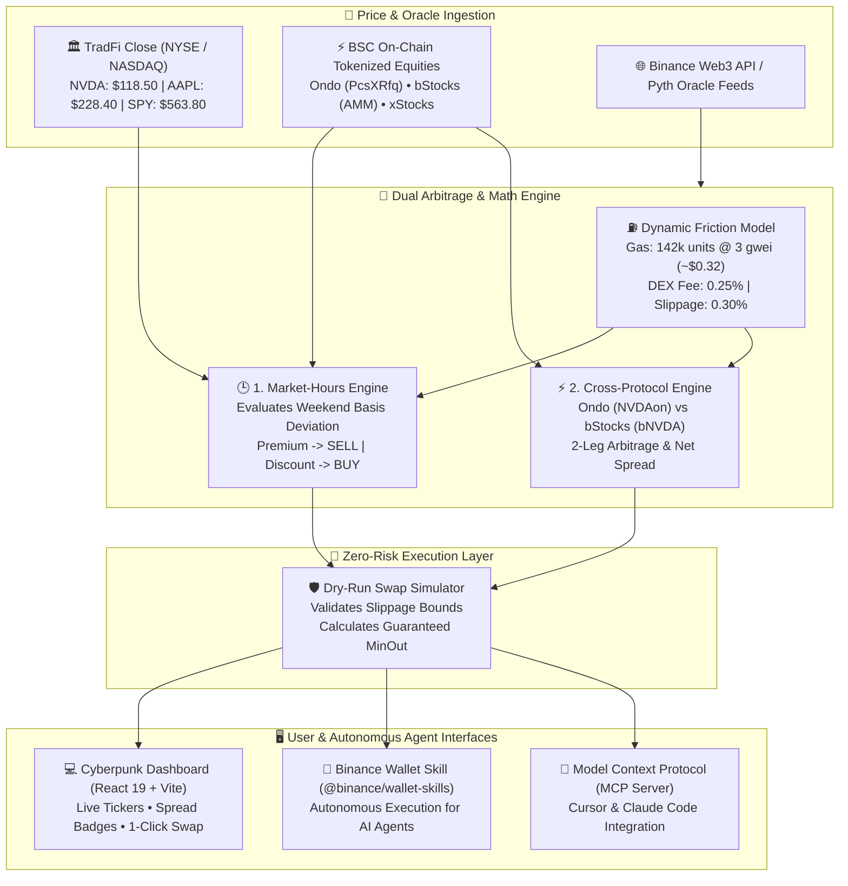

# BNB Chain Tokenized Stocks (RWA) Arbitrage Suite

[](https://bscscan.com)
[](https://www.typescriptlang.org/)
[](https://react.dev/)
[](https://github.com/arbincept/rwa-stock-arbitrage)
[](LICENSE)

> **Submission candidate for BNB Hackathons: Tokenized Stocks Edition. The project is now opensource and free to be copied or used from others peoples**  
> Built by **Arbitrage Inception** (`@arbincept`) • Author: **Luca Celebrano**

**Live deployment:** https://rwa-stock-arbitrage.vercel.app  
**Network:** BNB Smart Chain Mainnet (ChainID `56`)  
**Data policy:** market data and token catalog are loaded from real Binance Web3 RWA and DexScreener endpoints; no synthetic prices or fake token addresses are used.

---

## 🎯 Hackathon Track Alignment

This project was built from the ground up to fulfill the official wishlist requirements of the **BNB Hack: Tokenized Stocks Edition**:

| Track / Wishlist Requirement | Status | Implementation in this Repository |
| :--- | :---: | :--- |
| **Wishlist Idea #1: Market-Hours Arbitrage** | ✅ **Implemented** | Identifies 24/7 on-chain BSC price divergence vs frozen US TradFi market close (NYSE/NASDAQ) during weekends and after-hours (`src/engine/market-hours-arb.ts`). |
| **Wishlist Idea #2: Cross-Protocol Arbitrage** | ✅ **Implemented** | Exploits structural pricing spreads between competing wrappers for identical underlyings (e.g. Ondo Finance `NVDAon` vs bStocks `bNVDA` on BSC) (`src/engine/cross-protocol-arb.ts`). |
| **Special Prize: Binance Agentic Wallet** | ⚠️ **Candidate integration** | Local skill and stdio MCP adapter exist (`src/agent/wallet-skill.ts`, `src/agent/mcp-server.ts`); official bounty compatibility and hosted-agent evaluation are still pending. |
| **Developer Experience Report** | ⚠️ **Draft / needs evidence** | `docs/DEVELOPER_EXPERIENCE.md` exists, but its latency figures and protocol claims need reproducible logs and source references before they can support a submission. |
| **Production readiness** | ✅ **Validated** | Live Binance Web3 RWA data, DexScreener liquidity, Kyber route/build, wallet signing, balance reads, ERC-20 approval, and Buy/Sell swaps were tested on the deployed application. |

---

## 📐 High-Level Architecture



---

## 🪙 Verified BSC Tokenized Equity Catalog

Our suite monitors verified tokenized stock contracts deployed on **BNB Smart Chain (ChainID: 56)**:

| Underlying | Protocol | BSC Token Symbol | Contract Address | Venue / Routing |
| :--- | :--- | :--- | :--- | :--- |
The source of truth for the current BSC catalog is `VERIFIED_BSC_STOCKS` in `src/client/binance-rwa-client.ts`, checked against Binance's public RWA catalog. Live token and underlying-stock prices come from Binance Web3 RWA Dynamic V2 (`web3.binance.com`). These RWA data endpoints are public and do not require an API key; private keys must never be exposed in the browser bundle.

---

## 🧮 Mathematical & Financial Modeling

Real-world DeFi arbitrage fails when naive calculations ignore execution friction. Our engine computes the **Net Edge** after accounting for every source of friction on BSC:

$$\text{Gas Cost (USD)} = \frac{\text{Gas Units} \times \text{Gas Price (Wei)}}{10^{18}} \times P_{\text{BNB}}$$

$$\text{Total Friction (\%)} = \text{DEX Fee (\%)} + \text{Slippage Buffer (\%)} + \left(\frac{\text{Gas Cost (USD)}}{\text{Trade Size (USD)}} \times 100\right)$$

$$\text{Net Edge (\%)} = |\text{Gross Spread (\%)}| - \text{Total Friction (\%)}$$

### Friction Sensitivity by Capital Size (142,000 Gas @ 3 Gwei, BNB = $760):
- **$100 Trade:** Gas friction = $0.3238 / $100 = **0.3238%** (Total friction: ~0.87%)
- **$1,000 Trade:** Gas friction = $0.3238 / $1,000 = **0.0324%** (Total friction: ~0.58%)
- **$10,000 Trade:** Gas friction = $0.3238 / $10,000 = **0.0032%** (Total friction: ~0.55%)

An opportunity is flagged **Actionable** only if:
$$\text{Net Edge (\%)} \ge \text{Min Net Profit Threshold (default: 0.35\%)}$$

## 🔁 Live Swap Functionality

The deployed dashboard supports real, wallet-signed spot swaps on BNB Smart Chain through KyberSwap:

- **Buy:** USDT or native BNB → selected tokenized stock.
- **Sell:** selected tokenized stock → USDT or native BNB.
- **Balances:** reads native BNB and ERC-20 balances from BSC using viem.
- **Partial amounts:** 25%, 50%, 75%, and Max controls are available for Sell.
- **ERC-20 approval:** the UI checks allowance and requests approval before a Sell when required.
- **Preflight:** route/build data is checked with gas estimation and a call simulation before signing.
- **Safety:** Max keeps a 0.5% margin; native BNB also reserves `0.004 BNB` for gas.

Buy and Sell were manually validated on the live Vercel deployment for both BNB and USDT paths. These are spot swaps only and require the user to review and sign each wallet transaction.

---

## 🚀 Quickstart & Installation

### Prerequisites
- Node.js `>= 22.0.0`
- npm `>= 10.0.0`

### 1. Clone & Install
```bash
git clone https://github.com/arbincept/rwa-stock-arbitrage.git
cd rwa-stock-arbitrage
npm install
```

### 2. Run Deterministic Test Suite
```bash
npm test
```
This suite covers the current pure engines and tool definitions without requiring network access.

### 3. Run Live Kyber and Skill Integration Checks
```bash
npm run test:live
```
Live checks query Kyber route/build and the public market feeds. They require network access and may be skipped when an upstream route is unavailable.

### 4. Launch the Interactive Web Dashboard
```bash
npm run dev
```
Visit `http://localhost:5173` to explore the dashboard with live Binance RWA data, benchmark data, and a Kyber-backed swap widget supporting USDT and native BNB input. The wallet preflight runs before any user-signed transaction.

### 5. Build for Production
```bash
npm run build
```
Creates an optimized static bundle in `dist/` ready for decentralized hosting (IPFS, BNB Greenfield, or Vercel).

---

## 🤖 Binance Agentic Wallet & MCP Server Integration

Our suite includes native support for autonomous agent execution:

### Autonomous CLI Scanner
```bash
npm run agent:scan
```
Outputs structured market-hours scans, cross-protocol pairs, and a dry-run swap simulation directly in your terminal.

### Model Context Protocol (MCP) Server
To connect this engine to **Cursor**, **Claude Code**, or the **BNB Agent Studio**:
```json
{
  "mcpServers": {
    "rwa-stock-arbitrage": {
      "command": "node",
      "args": [
        "--experimental-strip-types",
        "/absolute/path/to/rwa-stock-arbitrage/src/agent/mcp-server.ts"
      ]
    }
  }
}
```

The server exposes 3 local tools:
1. `scan_market_hours_gaps`: Discovers weekend / after-hours pricing disparities against TradFi close.
2. `scan_cross_protocol_gaps`: Discovers spreads between Ondo Finance and bStocks wrappers on BSC.
3. `simulate_stock_swap`: Queries Kyber route/build, produces slippage-protected calldata, and does not sign or submit it.

---

## 📑 Developer Experience Report

The developer-experience report exists as a draft. Its API, RPC, and agent-integration claims should be backed by reproducible commands, timestamps, and official documentation before final submission.

---

## 🔒 Security & Risk Management

- **Spot Only (No Perps):** In strict accordance with the hackathon rules, all mechanisms focus exclusively on spot tokenized assets.
- **Slippage Enforced:** Kyber-built calldata uses a 0.5% slippage tolerance and returns a minimum output estimate.
- **Zero Real Funds at Risk during Simulation:** The simulator queries Kyber and builds calldata without requiring private key signatures. Before explicit wallet signing, the UI runs `eth_estimateGas` and `eth_call` against the current wallet state.

---

## 👥 Authors & Acknowledgments

- **Arbitrage Inception** (`@arbincept`)
- Lead Developer: **Luca Celebrano**
- Built for the **BNB Hack: Tokenized Stocks Edition (September–October 2026)**.
