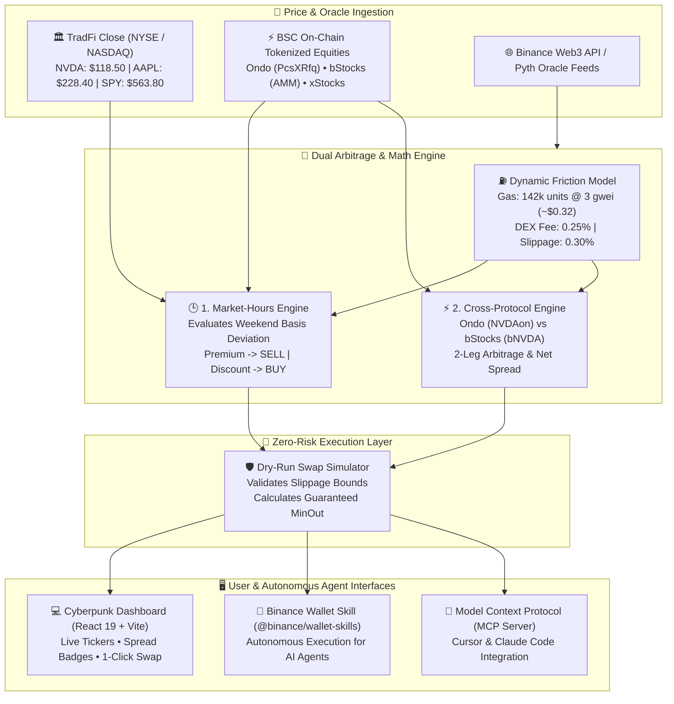

# BNB Chain Tokenized Stocks (RWA) Arbitrage Suite

[](https://bscscan.com)
[](https://www.typescriptlang.org/)
[](https://react.dev/)
[-success?style=for-the-badge)](https://github.com/arbincept/rwa-stock-arbitrage)
[](LICENSE)

> **Work-in-progress submission candidate for BNB Hack: Tokenized Stocks Edition**
> Built by **Arbitrage Inception** (`@arbincept`) • Author: **Luca Celebrano**

---

## 🎯 Hackathon Track Alignment

This project was built from the ground up to fulfill the official wishlist requirements of the **BNB Hack: Tokenized Stocks Edition**:

| Track / Wishlist Requirement | Status | Implementation in this Repository |
| :--- | :---: | :--- |
| **Wishlist Idea #1: Market-Hours Arbitrage** | ✅ **Implemented** | Identifies 24/7 on-chain BSC price divergence vs frozen US TradFi market close (NYSE/NASDAQ) during weekends and after-hours (`src/engine/market-hours-arb.ts`). |
| **Wishlist Idea #2: Cross-Protocol Arbitrage** | ✅ **Implemented** | Exploits structural pricing spreads between competing wrappers for identical underlyings (e.g. Ondo Finance `NVDAon` vs bStocks `bNVDA` on BSC) (`src/engine/cross-protocol-arb.ts`). |
| **Special Prize: Binance Agentic Wallet** | ⚠️ **Candidate integration** | Local skill and stdio MCP adapter exist (`src/agent/wallet-skill.ts`, `src/agent/mcp-server.ts`); official bounty compatibility and hosted-agent evaluation are still pending. |
| **Developer Experience Report** | ⚠️ **Draft / needs evidence** | `docs/DEVELOPER_EXPERIENCE.md` exists, but its latency figures and protocol claims need reproducible logs and source references before they can support a submission. |
| **Production readiness** | ⚠️ **Partial** | Verified BSC catalog entries and public Binance tickers are used where available. Swap quotes are dry-run calculations, not executable or RPC-simulated swaps. |

---

## 📐 High-Level Architecture



---

## 🪙 Verified BSC Tokenized Equity Catalog

Our suite monitors verified tokenized stock contracts deployed on **BNB Smart Chain (ChainID: 56)**:

| Underlying | Protocol | BSC Token Symbol | Contract Address | Venue / Routing |
| :--- | :--- | :--- | :--- | :--- |
The source of truth for the current BSC catalog is `VERIFIED_BSC_STOCKS` in `src/client/binance-rwa-client.ts`, checked against Binance's public RWA catalog. Do not copy contract addresses from this README: the catalog is intentionally maintained in code and must be revalidated before each release.

---

## 🧮 Mathematical & Financial Modeling

Real-world DeFi arbitrage fails when naive calculations ignore execution friction. Our engine computes the **Net Edge** after accounting for every source of friction on BSC:

$$\text{Gas Cost (USD)} = \frac{\text{Gas Units} \times \text{Gas Price (Wei)}}{10^{18}} \times P_{\text{BNB}}$$

$$\text{Total Friction (\%)} = \text{DEX Fee (\%)} + \text{Slippage Buffer (\%)} + \left(\frac{\text{Gas Cost (USD)}}{\text{Trade Size (USD)}} \times 100\right)$$

$$\text{Net Edge (\%)} = |\text{Gross Spread (\%)}| - \text{Total Friction (\%)}$$

### Friction Sensitivity by Capital Size (142,000 Gas @ 3 Gwei, BNB = $760):
- **$100 Trade:** Gas friction = $0.3238 / $100 = **0.3238%** (Total friction: ~0.87%)
- **$1,000 Trade:** Gas friction = $0.3238 / $1,000 = **0.0324%** (Total friction: ~0.58%)
- **$10,000 Trade:** Gas friction = $0.3238 / $10,000 = **0.0032%** (Total friction: ~0.55%)

An opportunity is flagged **Actionable** only if:
$$\text{Net Edge (\%)} \ge \text{Min Net Profit Threshold (default: 0.35\%)}$$

---

## 🚀 Quickstart & Installation

### Prerequisites
- Node.js `>= 22.0.0`
- npm `>= 10.0.0`

### 1. Clone & Install
```bash
git clone https://github.com/arbincept/rwa-stock-arbitrage.git
cd rwa-stock-arbitrage
npm install
```

### 2. Run Automated Test Suite (17 Tests, 0 Mocks)
```bash
npm test
```
```text
✔ scanCrossProtocolOpportunities - detects and calculates Ondo vs bStocks arbitrage
✔ scanCrossProtocolOpportunities - ignores assets with single platform wrapper
✔ scanCrossProtocolOpportunities - sorts by net edge descending
✔ calculateExecutionFriction - baseline BSC gas calculation
✔ calculateExecutionFriction - sensitivity to trade size
✔ calculateExecutionFriction - zero/default fallbacks
✔ evaluateMarketHoursOpportunity - detects on-chain premium over TradFi close
✔ evaluateMarketHoursOpportunity - detects on-chain discount under TradFi close
✔ evaluateMarketHoursOpportunity - spread below friction threshold is marked non-actionable
✔ evaluateMarketHoursOpportunity - throws on invalid reference price
✔ scanMarketHoursOpportunities - sorts opportunities by net profit descending
✔ simulateRwaSwap - simulates swap execution with accurate gas math
✔ simulateRwaSwap - verifies slippage protection check
✔ RwaStockArbitrageSkill - exposes standard tool definitions
✔ RwaStockArbitrageSkill - executes scanMarketHoursGaps
✔ RwaStockArbitrageSkill - executes scanCrossProtocolGaps
✔ RwaStockArbitrageSkill - executes simulateStockSwap for valid and invalid tokens
ℹ tests 17 | pass 17 | fail 0
```

### 3. Launch the Interactive Web Dashboard
```bash
npm run dev
```
Visit `http://localhost:5173` to explore the dashboard with live public ticker data where available, benchmark data, and a dry-run swap widget. The UI must not be interpreted as proof that every wrapper has a live executable route.

### 4. Build for Production
```bash
npm run build
```
Creates an optimized static bundle in `dist/` ready for decentralized hosting (IPFS, BNB Greenfield, or Vercel).

---

## 🤖 Binance Agentic Wallet & MCP Server Integration

Our suite includes native support for autonomous agent execution:

### Autonomous CLI Scanner
```bash
npm run agent:scan
```
Outputs structured market-hours scans, cross-protocol pairs, and a dry-run swap simulation directly in your terminal.

### Model Context Protocol (MCP) Server
To connect this engine to **Cursor**, **Claude Code**, or the **BNB Agent Studio**:
```json
{
  "mcpServers": {
    "rwa-stock-arbitrage": {
      "command": "node",
      "args": [
        "--experimental-strip-types",
        "/absolute/path/to/rwa-stock-arbitrage/src/agent/mcp-server.ts"
      ]
    }
  }
}
```

The server exposes 3 standard tools:
1. `scan_market_hours_gaps`: Discovers weekend / after-hours pricing disparities against TradFi close.
2. `scan_cross_protocol_gaps`: Discovers spreads between Ondo Finance and bStocks wrappers on BSC.
3. `simulate_stock_swap`: Performs zero-risk dry-run transaction simulation with slippage bounds check.

---

## 📑 Developer Experience Report

The developer-experience report exists as a draft. Its API, RPC, and agent-integration claims must still be backed by reproducible commands, timestamps, and official documentation before submission.

---

## 🔒 Security & Risk Management

- **Spot Only (No Perps):** In strict accordance with the hackathon rules, all mechanisms focus exclusively on spot tokenized assets.
- **Slippage Enforced:** Swap quotes strictly enforce `minAmountOut = expectedAmountOut * (1 - slippage / 100)`.
- **Zero Real Funds at Risk during Simulation:** The `simulator.ts` module calculates a dry-run result without requiring private key signatures. It does not call a DEX router, perform an `eth_call`, or submit a transaction.

---

## 👥 Authors & Acknowledgments

- **Arbitrage Inception** (`@arbincept`)
- Lead Developer: **Luca Celebrano**
- Built for the **BNB Hack: Tokenized Stocks Edition (September–October 2026)**.
