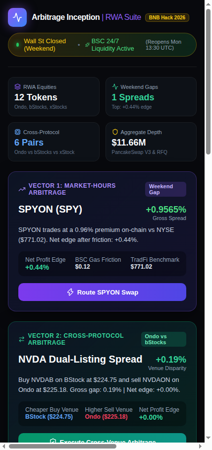

<div align="center">

# RWA Stock Arbitrage Suite

**Explore the gap between stock-market hours and on-chain prices.**

Built and maintained by **[Luca Celebrano · @Lukecele](https://github.com/Lukecele)**, founder of [Arbitrage Inception](https://github.com/arbincept).

**[Open app](https://rwa-stock-arbitrage.vercel.app)** · **[Star this repository](https://github.com/arbincept/rwa-stock-arbitrage)** · **[Follow Lukecele](https://github.com/Lukecele)**

[Quick start](#quick-start) · [Contribute](#contribute) · [MIT license](LICENSE)

</div>



<sub>Application screenshot from this repository. Live data and available routes change over time.</sub>

## What you can explore

| Workflow | Question it helps investigate |
| :--- | :--- |
| **Market-hours gaps** | How does a tokenized stock's on-chain price compare with its equity benchmark outside market hours? |
| **Cross-protocol spreads** | How do wrappers for the same underlying stock differ in price? |
| **Friction modeling** | How do gas, trade size, fees, and slippage affect the estimated edge? |
| **Swap simulation** | Can KyberSwap return a route and build calldata for a proposed spot swap? |

Built with **React, TypeScript, Vite, and viem** for BNB Smart Chain. Market data comes from Binance Web3 RWA endpoints and DexScreener. The current catalog lives in [binance-rwa-client.ts](src/client/binance-rwa-client.ts).

## Try it

1. Open the dashboard and inspect a tokenized equity and its market data.
2. Compare the market-hours and cross-protocol panels.
3. Review the trade-size and friction assumptions behind any estimated edge.

The web dashboard also includes **real wallet-signed Buy/Sell spot swaps** through KyberSwap. Simulation builds route data without signing or submitting a transaction; wallet execution is a separate action that requires reviewing approvals and signatures.

## Quick start

Use **Node.js 22+** and **npm 10+**.

```bash
git clone https://github.com/arbincept/rwa-stock-arbitrage.git
cd rwa-stock-arbitrage
npm install
npm run dev
```

Open [localhost:5173](http://localhost:5173). Public RWA data endpoints do not require an API key; data and routes depend on upstream availability.

### Project checks

```bash
npm test
npm run build
```

`npm test` runs the deterministic checks. For network-dependent provider checks, run `npm run test:live`; those checks depend on upstream routes and can fail when a route is unavailable.

## CLI and agent tooling

```bash
npm run agent:scan
```

This command prints market-hours scans, cross-protocol results, and a dry-run swap simulation.

An experimental stdio adapter is available through `npm run agent:mcp` in [mcp-server.ts](src/agent/mcp-server.ts). It implements `tools/list` and `tools/call` for:

- `scan_market_hours_gaps`
- `scan_cross_protocol_gaps`
- `simulate_stock_swap`

The adapter does not currently implement the MCP initialization handshake. Full MCP-client compatibility and hosted Binance Agentic Wallet integration remain work to validate; it should not be treated as a ready-to-use autonomous trading agent.

## Explore the implementation

- [Market-hours engine](src/engine/market-hours-arb.ts)
- [Cross-protocol engine](src/engine/cross-protocol-arb.ts)
- [Friction model](src/engine/friction-model.ts)
- [Swap simulator](src/engine/simulator.ts)
- [Architecture notes](docs/ARCHITECTURE.md)

Built for **BNB Hack: Tokenized Stocks Edition**. The [developer-experience report](docs/DEVELOPER_EXPERIENCE.md) is a draft; its performance and integration claims still need supporting evidence.

## Working with the results

A detected spread is a research signal, not a guaranteed executable profit. Liquidity, quote timing, gas, approvals, and slippage affect execution. The dashboard supports spot swaps; simulations do not reserve prices or liquidity.

## Contribute

Reproducible bug reports, clearer documentation, and focused improvements are welcome. Start with an [issue](https://github.com/arbincept/rwa-stock-arbitrage/issues) describing the behavior, environment, and expected result. Include the relevant checks with a pull request.

For sensitive reports, use the organization's [security policy](https://github.com/arbincept/.github/blob/main/SECURITY.md).

## More from Lukecele

This project is part of an independent ecosystem built by **[Luca Celebrano (@Lukecele)](https://github.com/Lukecele)**.

[Arb-Inc All-in-Dex](https://github.com/arbincept/Arb-Inc-All-in-Dex) · [Inception Flap Scanner](https://github.com/arbincept/inception-flap-scanner) · [BSC Arbitrage Scanner](https://github.com/arbincept/bsc-arbitrage-scanner)

If this project helps you, **[give it a star](https://github.com/arbincept/rwa-stock-arbitrage)** and **[follow Lukecele](https://github.com/Lukecele)** for future builds. [Sponsorship](https://github.com/sponsors/Lukecele) helps support ongoing work.

[Telegram](https://t.me/ArbitrageInception) · [Updates on X](https://x.com/Arbitrageincept) · [MIT license](LICENSE)
